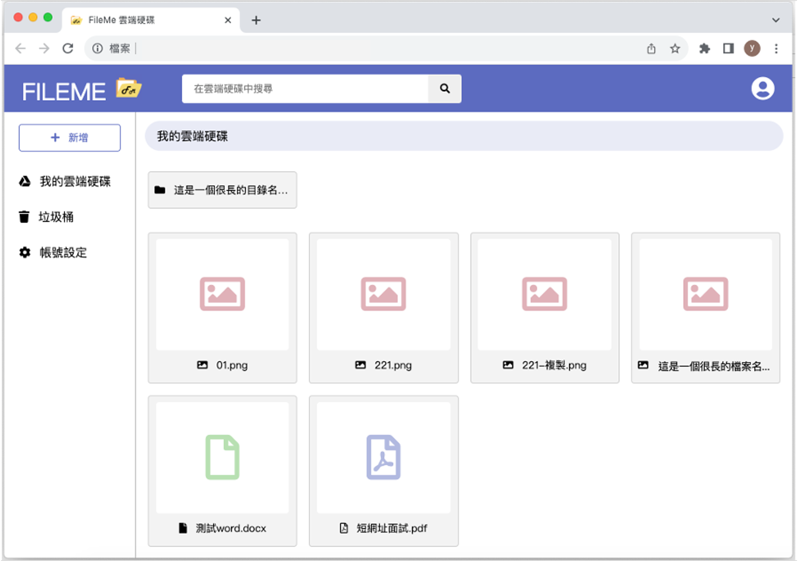

# FileMe雲端硬碟

FileMe 是一個支援本地端和雲端儲存的檔案管理系統，採用前後端分離架構設計。

## 專案 Repo
- **後端 Repo**: [FileMe 後端 Repo](https://github.com/yvon-ts/FileMe)
- **前端 Repo**: [FileMe 前端 Repo](https://github.com/yvon-ts/FileMe-front-end)

## 系統環境
- JDK 8
- Spring Boot 2.7.5
- MySQL 8
- Redis 7

## 開發環境
- **後端**：IntelliJ IDEA 2022
- **前端**：VS Code 2023

## 第三方服務
- Google SMTP

## 雲端部署
> 使用以下AWS服務並建置於有內外網設定的VPC環境
- 後端主機：EC2
- 資料庫：RDS (MySQL), ElastiCache (Redis)
- 前端網站託管 & DNS：S3, Route53

## 套件說明
### 後端套件
> 套件皆使用Maven統一管理，詳細套件清單及版本請參閱 `pom.xml`
- 資料庫持久層：MyBatis Plus
- 安全性：Spring Security + JJWT
- 日誌：Logback
- API文件：OpenAPI (Swagger)

### 前端套件
- jQuery 3.3.1
- jQuery contextMenu
- jQuery UI 1.13.2
- Axios
- SweetAlert2

## 組態檔設定
> 請參考 `mock.properties` 設定
- 資料庫連線資訊
- S3連線資訊
- Redis連線資訊
- Google SMTP連線資訊
- 本地端檔案上傳位址

## 功能概述
### 會員中心
> 各項功能皆以系統驗證信進行身份確認
- 註冊
- 資料變更(密碼、信箱)
- 忘記密碼

### 目錄與檔案管理
#### Create
- 新增目錄、新增檔案
#### Read
- 查看目錄
- 預覽檔案
- 下載檔案
- 分享檔案連結
- 模糊搜尋(依相關度排列：關鍵字數量、關鍵字位置)
#### Update
- 更改目錄和檔案名稱
- 權限管理
- 移動目錄和檔案位置
- 移至垃圾桶
- 從垃圾桶還原
#### Delete
- 立即刪除
